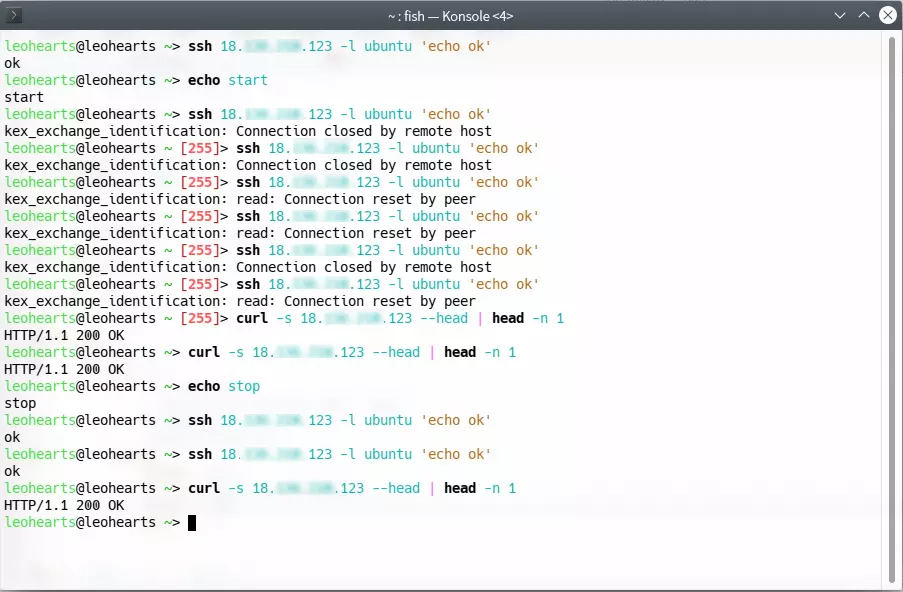

# ssh-dos-python
"Mild" denial of service for ssh with python

### Requirements

```pip install ssh-python```

### Usage

```shell
python3 ssh-dos.py [host] [CONCURRENT](optional, default=140)
```

### 灵感来源 & 用处

[In SSHD Configuration what does "MaxStartups 10:30:60" mean?](https://stackoverflow.com/questions/4812134/in-sshd-configuration-what-does-maxstartups-103060-mean)

>> I Want to know what is the meaning of MaxStartups 10:30:60?
>
>10: Number of unauthenticated connections before we start dropping
>
>30: Percentage chance of dropping once we reach 10 (increases linearly for more than 10)
>
>60: Maximum number of connections at which we start dropping everything

在我的```Ubuntu server 20.04```上, 它默认是```10:30:100```.

也就是说, 在开启100个认证连接后, sshd将不再接受新连接.

这就提供了一种在特定环境(如AWD比赛)下的攻击思路: 提前开一大堆connection占满ssh的连接数限制, 服务器就不会再接受之后的连接. 攻击者不需要提供密码.

此前我尝试使用```paramiko```实现, 但由于```paramiko```的限制, 客户端不能停留在等待认证的阶段, cpu/网络占用都过高. 在某次允许DOS的线下赛的末尾我尝试使用该程序, 它成功导致目标主机ssh不能登陆.

#### 请注意规则是否允许该攻击方式. 该攻击理论上不大量消耗带宽, 且仅在开始几秒消耗目标CPU, 但若靶机太辣鸡(内存爆炸导致kswapd消耗CPU, 该攻击大约占用目标150M内存)可能依然会被判定为CC.

~~开一下对面靶机ssh都登上不去, 还玩个毛线~~

### Screenshot:


